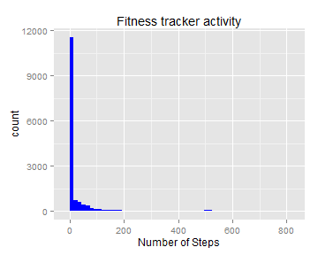
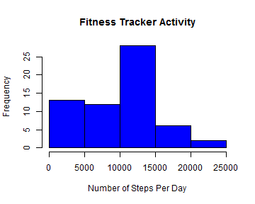
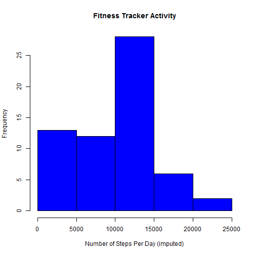

## Libraries
Start by loading some of the libraries that will be used and
setting the knitr options.  Note that, contrary to what the instructions
claim, the figures are not saved by default, so this has to be set.


```r
library(knitr, quiet=T)
library(plyr, quiet=T)  
library(ggplot2, quiet=T) 
```

```
## Need help? Try the ggplot2 mailing list: http://groups.google.com/group/ggplot2.
```

```r
opts_chunk$set(dev="png", fig.path="figure/")
```
 
## Loading and preprocessing the data
 
Load the data.  Store the data both as a factor and as a POSIX date: 


```r
if (!file.exists("activity.csv")) stop("activity.csv not avaiable")
activity <- read.csv("activity.csv", header=TRUE, 
                      colClasses=c("numeric", "character", "numeric"),
                      stringsAsFactors=FALSE)
activity$date.factor <- as.factor(activity$date)
activity$date <- as.Date(activity$date, format="%Y-%m-%d")
```

## What is mean total number of steps taken per day?
Now make a histogram of the number of steps.  Here Now make a histogram of the number of steps per day. Here we will ignore any missing values.
 

```r
g <- ggplot(activity, aes(steps))
g + geom_histogram(binwidth=15, fill='blue') + labs(title="Fitness tracker activity", x="Number of Steps")
```

 

```r
require(plyr)
activity.daily <- ddply(activity, .(date.factor), summarize, total.steps=sum(steps, na.rm=TRUE))
hist(activity.daily$total.steps, col="blue", main="Fitness Tracker Activity", xlab="Number of Steps Per Day")
```

 
 
## The mean and median per interval are:


```r
mn <- mean(activity$steps, na.rm=TRUE)
md <- median(activity$steps, na.rm=TRUE)
cat(paste("The mean number of steps per interval is", format(mn, digits=4), "and the median is", format(md, digits=2), "(ignoring missing values)"), format(md, digits=2), "(ignoring missing values)")
```

```
## The mean number of steps per interval is 37.38 and the median is 0 (ignoring missing values) 0 (ignoring missing values)
```
 
This is a rather skewed distribution with a large number of zero values; perhaps some test subjects aren't actually using their devices.And per day (which is the question from the assignment)


```r
mn <- mean(activity.daily$total.steps, na.rm=TRUE)
md <- median(activity.daily$total.steps, na.rm=TRUE)
cat(paste("The mean number of steps per day is", format(mn, digits=4), "and the median is", format(md, digits=2), "(ignoring missing values"))
```

```
## The mean number of steps per day is 9354 and the median is 10395 (ignoring missing values
```
 
## What is the average daily activity pattern?
 
-121,6 +126,12 are not exactly equal after imputation if more digits are shown, but are quite close.Imputing using the median would have a very different effect, and would lower the mean.Make a histogram of the mean number per day after imputation.


```r
hist(activity.daily$total.steps, col="blue", main="Fitness Tracker Activity", xlab="Number of Steps Per Day (imputed)")
```

 

## Check to make sure we filled in all the missing values:


```r
nmissing <- sum(!complete.cases(activity.daily$total.steps))
cat(paste("The missing values of steps per day is", format(nmissing, digits=4)))
```

```
## The missing values of steps per day is 0
```
